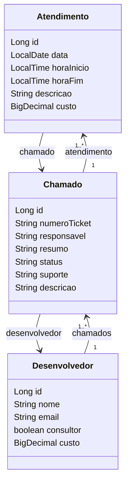

Diagrama de classes

```mermaid
classDiagram
    class Atendimento {
        Long id
        LocalDate data
        LocalTime horaInicio
        LocalTime horaFim
        String descricao
        BigDecimal custo
    }
    
    class Chamado {
        Long id
        String numeroTicket
        String responsavel
        String resumo
        String status
        String suporte
        String descricao
    }

    class Desenvolvedor {
        Long id
        String nome
        String email
        boolean consultor
        BigDecimal custo
    }

    Atendimento --> Chamado : chamado
    Chamado "1" --> "1..*" Atendimento : atendimento
    Chamado --> Desenvolvedor : desenvolvedor
    Desenvolvedor "1" --> "1..*" Chamado : chamados
```
